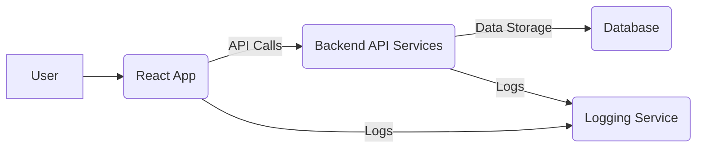

# System Design Document: URL Shortener Application

## 1. Introduction

This document outlines the system design for a URL Shortener application, comprising a React-based frontend and a backend API. The application allows users to shorten long URLs, optionally set validity periods and preferred shortcodes, and view statistics for the shortened URLs.

## 2. System Architecture

The application follows a client-server architecture, with a clear separation between the frontend (React application) and the backend (API services).

### 2.1. High-Level Diagram



The system architecture consists of:

*   **User**: Interacts with the frontend application.
*   **React Frontend**: The client-side application built with React and Material UI, responsible for user interface and interaction. It communicates with the Backend API for URL shortening and statistics.
*   **Backend API Services**: Handles business logic, interacts with the database, and provides API endpoints for the frontend.
*   **Database**: Stores information about original URLs, shortened URLs, click counts, validity, preferred shortcodes, etc.
*   **Logging Service**: A centralized service for collecting logs from both frontend and backend, as per the requirements.

## 3. API Design

#### 3.1. URL Shortening API

*   **Endpoint**: `POST /shorten` (Placeholder - precise endpoint to be confirmed by user)
*   **Request Body**:
    ```json
    {
      "originalUrl": "string",
      "validity": "number" (optional, in minutes),
      "preferredShortcode": "string" (optional)
    }
    ```
*   **Response Body (Success)**:
    ```json
    {
      "originalUrl": "string",
      "shortenedUrl": "string",
      "shortCode": "string",
      "expiresAt": "datetime" (optional)
    }
    ```
*   **Response Body (Error)**:
    ```json
    {
      "error": "string",
      "message": "string"
    }
    ```

#### 3.2. URL Statistics API

*   **Endpoint**: `GET /stats` or `GET /urls` (Placeholder - precise endpoint to be confirmed by user)
*   **Request Parameters**: (Optional, e.g., for filtering by user or date)
*   **Response Body (Success)**:
    ```json
    [
      {
        "originalUrl": "string",
        "shortenedUrl": "string",
        "shortCode": "string",
        "clicks": "number",
        "createdAt": "datetime",
        "expiresAt": "datetime" (optional)
      }
    ]
    ```
*   **Response Body (Error)**:
    ```json
    {
      "error": "string",
      "message": "string"
    }
    ```

## 4. Technical Stack

*   **Frontend**:
    *   **Framework**: React (no TypeScript)
    *   **UI Library**: Material UI (`@mui/material`, `@emotion/react`, `@emotion/styled`)
    *   **Routing**: `react-router-dom`
    *   **Build Tool**: Webpack
    *   **Transpiler**: Babel
    *   **HTTP Client**: `fetch` API (or `axios` if preferred for more features)

*   **Backend**: (Assumed, based on API requirements)
    *   Likely a RESTful API built with a language/framework like Node.js (Express), Python (Flask/Django), Java (Spring Boot), Go, etc.
    *   Database: Relational (e.g., PostgreSQL, MySQL) or NoSQL (e.g., MongoDB), depending on the specific backend implementation.

## 5. Logging and Monitoring

*   **Logging Middleware (`frontend/src/middleware/logger.js`)**:
    *   Captures significant events (info, errors, warnings) from the frontend.
    *   Sends log data to a centralized logging service (`http://20.244.56.144/evaluation-service/logs`).
    *   Includes `stack`, `level`, `package`, and `message` in the log payload.
    *   Authenticates requests with a `Bearer` token.
*   **Backend Logging**: (Assumed) The backend services would also implement logging to the same centralized logging service for a unified view of application health.

## 6. Error Handling

*   **Frontend**:
    *   API call errors are caught and displayed to the user (e.g., using Material UI's `Alert` component).
    *   Logging middleware is used to report these errors to the centralized logging service.
    *   Input validation is performed on the `UrlForm` to guide users.
*   **Backend**: (Assumed)
    *   Backend APIs should return meaningful error codes and messages for different failure scenarios (e.g., invalid input, database errors, internal server errors).
    *   Appropriate HTTP status codes should be used for responses.

## 7. Data Model

(This section assumes a relational database for the backend)

*   **`urls` Table**:
    *   `id` (Primary Key, UUID)
    *   `original_url` (Text, NOT NULL)
    *   `short_code` (Text, UNIQUE, NOT NULL)
    *   `shortened_url` (Text, NOT NULL)
    *   `created_at` (Timestamp, NOT NULL)
    *   `expires_at` (Timestamp, NULLABLE)
    *   `clicks` (Integer, Default 0)
    *   `user_id` (Foreign Key, NULLABLE - if authentication is implemented)

## 8. Deployment

*   **Frontend**: Can be deployed as static files on a web server (e.g., Nginx, Apache) or a CDN, as it's a client-side React application.
*   **Backend**: Can be deployed on a cloud platform (e.g., AWS EC2, Google Cloud Run, Azure App Service) or on-premise servers, typically containerized using Docker.

## 9. Security Considerations

*   **API Token Security**: The `ACCESS_TOKEN` used for logging and API calls should be securely managed (e.g., environment variables, a secure credential management system) and not hardcoded in production environments.
*   **Input Validation**: Strict input validation on both frontend and backend to prevent injection attacks (e.g., XSS, SQL injection).
*   **HTTPS**: All communication between frontend, backend, and logging service should use HTTPS to encrypt data in transit.
*   **Rate Limiting**: Implement rate limiting on URL shortening and statistics APIs to prevent abuse and DoS attacks.
