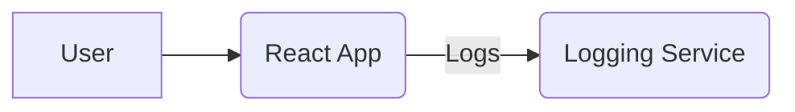

# System Design Document: URL Shortener Application

## 1. Introduction

This document outlines the system design for a URL Shortener application, comprising a React-based frontend only. The application allows users to shorten long URLs (simulated), optionally set validity periods and preferred shortcodes, and view statistics for the shortened URLs (simulated).

## 2. System Architecture

The application follows a client-side architecture.

### 2.1. High-Level Diagram

The system architecture consists of:

*   **User**: Interacts with the frontend application.
*   **React Frontend**: The client-side application built with React and Material UI, responsible for user interface and interaction. It simulates URL shortening and statistics display.
*   **Logging Service**: A centralized service for collecting logs from the frontend, as per the requirements.

## 3. API Design (Simulated)

#### 3.1. URL Shortening Simulation

*   The frontend directly generates a mock shortened URL based on the input. No actual API call is made to a backend for shortening.

#### 3.2. URL Statistics Simulation

*   The frontend displays hardcoded/mock statistics. No actual API call is made to a backend for statistics.

## 4. Technical Stack

*   **Frontend**:
    *   **Framework**: React (no TypeScript)
    *   **UI Library**: Material UI (`@mui/material`, `@emotion/react`, `@emotion/styled`)
    *   **Routing**: `react-router-dom`
    *   **Build Tool**: Webpack
    *   **Transpiler**: Babel
    *   **HTTP Client**: Not used for core functionality, only for logging.

## 5. Logging and Monitoring

*   **Logging Middleware (`frontend/src/middleware/logger.js`)**:
    *   Captures significant events (info, errors, warnings) from the frontend.
    *   Sends log data to a centralized logging service (`http://20.244.56.144/evaluation-service/logs`).
    *   Includes `stack`, `level`, `package`, and `message` in the log payload.
    *   Authenticates requests with a `Bearer` token.

## 6. Error Handling

*   **Frontend**:
    *   Simulated API call errors are handled locally and displayed to the user.
    *   Logging middleware is used to report these events to the centralized logging service.
    *   Input validation is performed on the `UrlForm` to guide users.

## 7. Data Model

*   Since there is no backend, there is no persistent data model. All data is handled in-memory within the frontend application.

## 8. Deployment

*   **Frontend**: Can be deployed as static files on a web server (e.g., Nginx, Apache) or a CDN.

## 9. Security Considerations

*   **API Token Security**: The `ACCESS_TOKEN` used for logging API calls should be securely managed (e.g., environment variables, a secure credential management system) and not hardcoded in production environments.
*   **Input Validation**: Input validation is performed on the frontend. Since there is no backend, backend-specific security considerations like SQL injection are not applicable.
*   **HTTPS**: All communication with the logging service should use HTTPS to encrypt data in transit.
