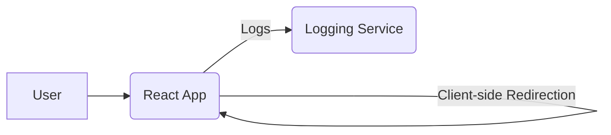

# System Design Document: URL Shortener Application

## 1. Introduction

This document outlines the design for a React-based URL Shortener application, which simulates URL shortening and statistics display.

## 2. System Architecture

The application is a client-side (frontend-only) React application.

### 2.1. High-Level Diagram

The system architecture consists of:

*   **User**: Interacts with the React frontend.
*   **React Frontend**: Handles UI, simulated functionalities, and client-side URL redirection.
*   **Logging Service**: Centralized service for frontend logs.

## 3. API Design (Simulated)

*   **URL Shortening**: The frontend directly generates mock shortened URLs, ensuring uniqueness and respecting validity/shortcode preferences.
*   **URL Statistics**: The frontend displays mock statistics with enhanced realism including clicks, creation, and expiry dates, and detailed click data (timestamp, source, location).

## 4. Technical Stack

*   **Frontend**: React (no TypeScript), Material UI, React Router DOM.
*   **Build & Transpilation**: Webpack, Babel.
*   **HTTP Client**: `fetch` API (only for logging, not core functionality).

## 5. Logging and Monitoring

*   **Frontend Logging**: Events (info, errors, warnings) are captured and sent to `http://20.244.56.144/evaluation-service/logs` with an authentication token.

## 6. Error Handling

*   **Client-side Validation**: URL input fields have validation for immediate user feedback (e.g., invalid URL format, shortcode collision, missing original URL for custom shortcode).
*   **Simulated API Errors**: Handled locally and reported to the logging service.

## 7. Data Model

*   No backend persistence; all data is in-memory.
*   **Local Storage**: Shortened URLs (including shortcodes, original URLs, expiry dates) and form inputs are saved in `localStorage` for session persistence. Mock statistics data is also persisted in `localStorage`.

## 8. Deployment

*   **Frontend**: Deployed as static files (e.g., on a web server or CDN). Handles client-side routing for shortened URLs.

## 9. Security Considerations

*   **API Token Security**: The `ACCESS_TOKEN` for logging should be managed securely, not hardcoded in production.
*   **Input Validation**: Frontend validation helps prevent common input-related issues.
*   **HTTPS**: Communication with the logging service should use HTTPS.
